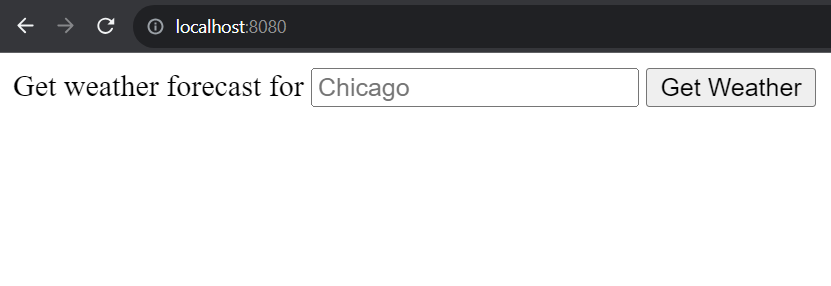

# weather_app
A weather app that returns various information about weather. Backend in Go. Planning to frontend with HTMX and possibly create a Flutter app with it.

Run the gin server with:

```
cd ./<parent_dir> # <-- Should see weather_app.go here
go run .
```

To test, open a separate window and run `curl` command:

```
# Get weather in Seattle
curl "localhost:8080/weather?city=Seattle
```

Alternatively, run the server and see below:

# HTMX Frontend
This weather app's frontend is designed using HTMX. HTMX is an open-source project from [bigskysoftware/hmtx @ GitHub](https://github.com/bigskysoftware/htmx) .

HTMX offers some nice, fast front-end features without writing a bunch of JS. Nice.

If you run `go run .` then go to your browser and enter `localhost:8080`, or whichever port you chose to run on, you should see:



From there, you can enter the city of your choose and a nice css smooth transition should swap out the search bar with your results.